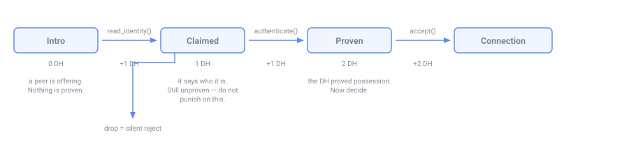
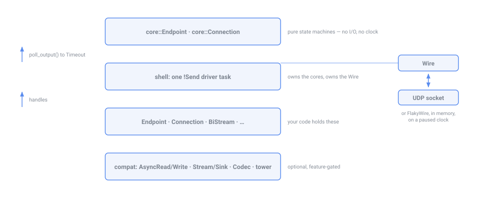

# slither

<!-- ACTIVATES ON PUBLISH: until the repo is public these badges 404 and
     crates.io cannot rewrite the docs/*.svg links.
[](https://crates.io/crates/slither) [](https://docs.rs/slither) [](https://github.com/primetype/slither/actions) -->

**v0.2.0** · MSRV **1.96** (edition 2024) · `MIT OR Apache-2.0` ·
`#![forbid(unsafe_code)]` · wire **ratified and frozen** ([`SPEC.md`](SPEC.md))
· 1 100+ tests · Linux and macOS in CI · **not independently audited** —
see [`SECURITY.md`](SECURITY.md).

Two peers exchange encrypted, reliable, unordered messages over UDP — plus
streams and unreliable datagrams — authenticated by raw public keys. No
certificates, no TLS, no PKI.

## Why slither

- **A peer is its public key.** No CA, no trust store, no certificate plumbing.
- **A staged accept ladder** — your application inspects a *claimed* identity
  and authorises it **before** the second Diffie-Hellman is spent; dropping the
  handle is the silent reject.
- **Connections roam** — an authenticated packet from a new address moves the
  session there; nothing unauthenticated ever does.
- **Drivable without a kernel** — two pure state machines behind one `Wire`
  trait, so your tests run the real protocol in memory on a paused clock.

## When not to use it

- Need **NAT traversal or relay fallback**? Use [iroh](https://crates.io/crates/iroh).
- Have **certificates**, want mainstream QUIC? Use [quinn](https://crates.io/crates/quinn).
- Want the **Noise handshake alone**, no transport? Use [snow](https://crates.io/crates/snow).

## Install

```toml
[dependencies]
slither = "0.2"
# `slither::channel!` expands to `::hiss::…`, so your crate needs hiss too.
hiss = { version = "0.3", default-features = false }
# slither's driver runs on YOUR runtime; these are the features it uses.
tokio = { version = "1", features = ["rt", "net", "time", "sync", "macros"] }
rand_chacha = "0.10"   # only for `SoftwareIdentity` — it takes an RNG you own
getrandom = "0.4"      # …and something to seed it from
```

**Nothing is on by default**; `test-util`, `sink`, `codec` and `tower` are
opt-in, and the table is on [docs.rs](https://docs.rs/slither). **`rand_core`
must be the 0.10 line hiss names** (`hiss::rand_core` re-exports it): two
majors in one graph give an unsatisfiable `CryptoRng` bound, not a version error.

## Requirements

**slither's driver is `!Send`.** It runs with `tokio::task::spawn_local` on a
**current-thread** runtime inside a **`LocalSet`**, and no handle crosses a
thread. `slither::prelude::block_on` is the one line that pays that tax.

If your application uses `#[tokio::main]` — the multi-threaded runtime —
`Endpoint::builder()…build()` **panics at runtime**; run slither on its own
current-thread runtime and bridge with channels. This is deliberate: it lets a
hardware-backed static key — an iOS Secure Enclave `SecKey`, not `Send` —
drive the handshake.

## Quickstart

```rust
use slither::prelude::*;                        // 0. the golden path, one line
slither::channel! { pub MySuite<P256, ChaChaPoly, Blake2b>; }   // 1. one suite
block_on(async {                                // 2. current-thread + LocalSet
    let me: SoftwareIdentity<MySuite> = SoftwareIdentity::generate(rng())?;
    let my_key = me.public_static().clone();    // 3. hand this to the peer
    let sock = tokio::net::UdpSocket::bind("0.0.0.0:0").await?; // it's a `Wire`
    let ep = Endpoint::builder().identity(me).wire(sock).build();
    let conn = ep.connect(peer_addr, peer_key)?.await?;          // 4. dial …
    conn.send_message(b"hello").await?;
    // … or answer: accept() -> read_identity() -> authenticate() -> accept()
});
```

<picture>
  <source media="(prefers-color-scheme: dark)" srcset="docs/staged-accept-dark.svg">
  
</picture>

**The full worked example is [`examples/echo.rs`](examples/echo.rs)** — two
endpoints on UDP loopback, one message, clean close (`cargo run --example
echo`). It is compiled by every `cargo test` run.

## Limits

- **No NAT traversal, no relays.** You supply reachable addresses.
  `set_persistent_keepalive` holds a NAT binding open; it does not punch one.
- **A reliable message is at most 262 144 B** (256 KiB); an unreliable datagram
  payload at most **1 169 B**. Every wire datagram is **≤ 1 200 B**, never
  fragmented.
- **A connection carrying no traffic dies in 25 s, in silence.** Connecting
  ahead of need does not keep a path warm.
- **One session per peer static** — reconnecting is `close()` then dial; and
  **messages and streams do not mix on one connection**.
- **Reliability lives inside a connection**; what a dead connection had not
  delivered is lost. No pacing, no ECN, no PMTUD; NewReno only.

Each is stated in full, at its call site, under **Before you integrate** on
[docs.rs](https://docs.rs/slither).

## How it works

<picture>
  <source media="(prefers-color-scheme: dark)" srcset="docs/architecture-dark.svg">
  
</picture>

slither borrows WireGuard's homework — a keyed-BLAKE2b mac1 DoS gate,
fresh-ephemeral handshake retransmission, an RFC 6479 replay window, roaming
and the keepalive/liveness/rekey timers — over
[`hiss`](https://crates.io/crates/hiss)'s Noise **IK** (**P-256 /
ChaCha20-Poly1305 / BLAKE2b**; no RustCrypto crates). Inside the sealed packets
rides a QUIC-shaped frame layer: streams, messages, datagrams, RFC 9002 loss
recovery and NewReno.

## Testability

The socket sits behind a small `Wire` trait, so the suite runs two endpoints
over an in-memory `FlakyWire` (loss, reorder, duplication, delay, partition,
send failure) on tokio's **paused clock** — the 5 s / 10 s / 25 s / 90 s timers
resolve in virtual time. Enable `test-util` to do the same in your own tests.

## Status

The wire is **ratified and frozen** (2026/08/14): every constant, header
layout, frame type and timer lives in [`SPEC.md`](SPEC.md), and the code
follows the spec, never the reverse — see [`CHANGELOG.md`](CHANGELOG.md). An
**independent crate**: zero `bubble-*` deps, everything from crates.io.

## License

Licensed under either of [Apache-2.0](LICENSE-APACHE) or [MIT](LICENSE-MIT), at
your option. Unless you explicitly state otherwise, any contribution
intentionally submitted for inclusion in the work by you, as defined in the
Apache-2.0 license, shall be dual licensed as above, without any additional
terms or conditions.
